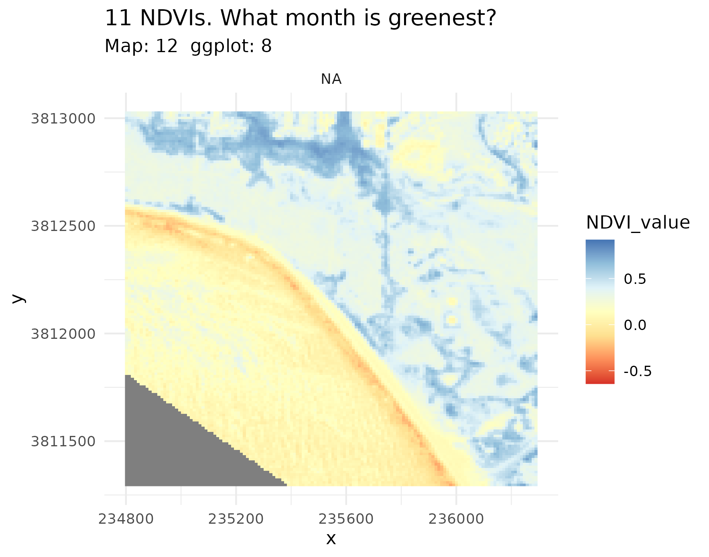

# ucsb-ratlas
### A geospatial R example atlas of the UCSB campus

A repo that uses local UCSB examples applied to all of the steps of the
Carpentries' Intro to Raster and Vector Data workshop.

Scripts run parallel to the episodes (ep_01.r ep_02.r ... ep_13.r) and create maps
'suitable for publication' (map01.r, map02.r, ... map12.r) as laid out in Maps 1 thru 12
below.

The goals are to produce nice atlas pages of campus that use all of
the techniques covered in the Intro to GeoSpatial R Carpentry lesson.

We have created a [Data Dictionary](datadictionary.md) to help us keep
track of object names and files.

## Getting Started

1: Clone this repo. 

2: Run `scripts/data_prep_new.r` This script downloads a folder from
our Carpentry Google drive into a `downloaded_data` directory), and unzips
it into `source_data`

3: Now you can run `run_ever_map.r` and `run_every_episode.r` (in that order) 
to produce output from these data sources. Any data that an episode writes is
placed in `output_data` and any formatted maps are placed in `images`. Both
are .gitignored. `final_output` has .png files used in the readme.

4: Script away! Feel free to tackle issues, express issues, or just
do work if you see work that needs to be done.

5: Episode scripts produce a number of maps, but not
particularly well formatted. They are formated as in the Lesson, with 
the addition of ggtitles to keep track of where they are generated.

All outputs from map scripts should have a 3 tall x 4 wide 
aspect ratio, except where noted.

### Map 1. A wide view of campus with

(issue #7)

-   Extent should be the same as #3 inset of map 7.
-   NCOS – for now the new lagoon habitat shapefile
-   Water
-   Bathymentry and elevation in one layer
    -   hillshade
-   walkways – using bike paths for now
-   buildings – for context
-   vernal pools:
    -   vector data to be create via analysis from DEMs
    -   this will come later 
    
Something like this:

### Map 2 A stylized thematic map with trees, water, and bikeways

Something like this:
Trees from
ArcGIS Online: Water: NCOS upper lagoon shapefile of bathymetric topo
lines or polygons is it this [bird habitat
file?](https://drive.google.com/file/d/1ssytmTbpC1rpT5b-h8AxtvSgNrsGQVNY/view?usp=drive_link)
– yes bird habitats

### Map 7 An atlas page layout with 4 insets:
Top tryptic is maps 3-4-5 zoom-in.
       Then Map 6

#### map 3 California Overview
Portrait 3x4
Western US

#### map 4 The Bite of California
Portrait 3x4
Needs to be further zoomed in. 
Maps 3-4-5: 

#### map 5 Extended Campus
(issue #14)
Landscape 4x3 \* extended campus will have maptiles background? \*
Bacara-ish to 154/101 

#### Map 6 Campus Detail
Wide Landscape 9x16ish? \* A stripped down version of map #1,
sympolized to match the look of 3-4-5

#### Map 3 sketch: 
we used to have a jpg of the whiteboard here.

### Map 8 RS Imagery
For starters, this will be one 8-band image
visualized several different ways. Which is an expansion of episode
5. 
Something like this:

### 9 Analysis: Find landscape depressions on Campus DEM
ie: identify vernal pools.
Find elevations > sea level that are surrounded by nearby neighbors that are higher.

### 10 Analysis: Find bike paths that cross water?

### Map 11: Look at a Dibblee

### Map 12  / Episode 12: 12 months of NDVI Raster Stack

[UCSB Carpentry](https://ucsbcarpentry.github.io)

[Original lesson -- Introduction to Geospatial Raster and Vector Data
with R](https://datacarpentry.org/r-raster-vector-geospatial/)
