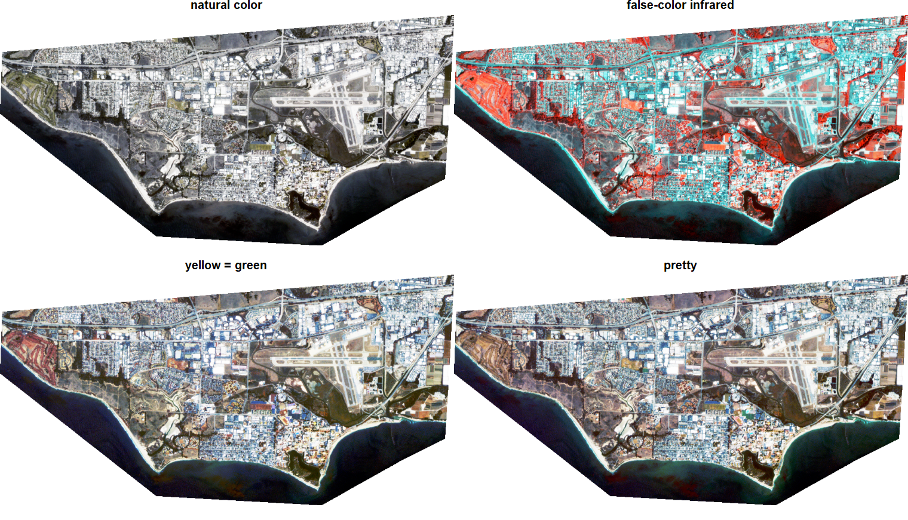
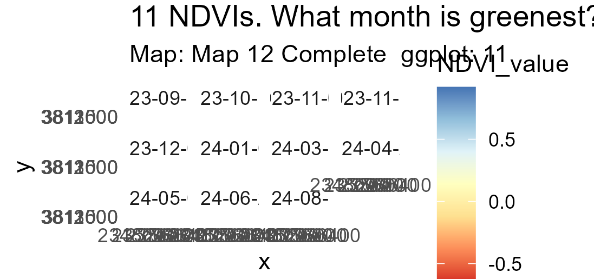

# ucsb-ratlas
### A geospatial R example atlas of the UCSB campus

August, 2025 outputs

We have created a [Data Dictionary](datadictionary.md) to help us keep
track of object names and files.

All outputs from map scripts should have a 3 tall x 4 wide 
aspect ratio, except where noted.

### Map 1. A wide view of campus 
Something like this:

### Map 2 A stylized thematic map with trees, water, and bikeways
Something like this:

## Map 7 An atlas page layout with 4 insets:
Top tryptic is maps 3-4-5 zoom-in.

### Zoooooommmm

### Map 6

####Maps 3-4-5 in a row

### Map 8 RS Imagery
Something like this:

### 9 Analysis: Find landscape depressions on Campus DEM
ie: identify vernal pools.
Find elevations > sea level that are surrounded by nearby neighbors that are higher.

### 10 Analysis: Find bike paths that cross water?

### Map 11: Look at a Dibblee

### Map 12  / Episode 12: 12 months of NDVI Raster Stack

[UCSB Carpentry](https://ucsbcarpentry.github.io)

[Original lesson -- Introduction to Geospatial Raster and Vector Data
with R](https://datacarpentry.org/r-raster-vector-geospatial/)
